---
# Please do not edit this file directly; it is auto generated.
# Instead, please edit 03-Simple-Linear-Regression.md in _episodes_rmd/
title: "Simple Linear Regression"
teaching: 45
exercises: 10
questions:
- "What is linear regression?
- "What are the assumptions we need to meet to use linear regression?"
- "How do I perform linear regression in R?"
- "How do I ensure that my data meets the model assumptions?"
objectives:
- "Understand theory of linear regression."
- "Use linear regression on our dataset."
- "Check the model diagnostics to ensure the data meets the assumptions of linear regression."
keypoints:
- 
output: html_document
---

<script
  src="https://cdn.mathjax.org/mathjax/latest/MathJax.js?config=TeX-AMS-MML_HTMLorMML"
  type="text/javascript">
</script>


Regression analysis is used to describe the relationship between a single dependent variable _Y_ (also called the outcome) and one or more independent 
variables _X<sub>1</sub>, X<sub>2</sub>, ..., X<sub>p</sub>_ (also called the predictors).
The case of one independent variable, i.e. _p_=1, is known as simple regression and the case where _p_>1 is known as multiple regression.

## Simple Linear Regression

In simple linear regression, the aim is to predict the dependent variable _Y_ based on a given value of the independent variable $X$ using a linear relationship. This relationship is described by the following equation:

_Y = a + bX + e_

where $a$ is the intercept, i.e. the value of _Y_ when _X=0_, and _b_ is the regression coefficient, i.e. the slope of the line.
$e$ represents an additive residual term (error) that accounts for random statistical noise or the effect of unobserved independent variables not included in the model.

In simple linear regression, we wish to find the values of _a_ and _b_ that best describe the relationship given by the data.

This objective can be thought of as drawing a straight line that best fits the plotted data points.
The line can then be used to predict Y from X.

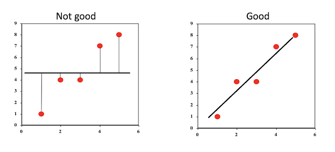

## Least Squares Estimation

Ordinary least squares (OLS) is a common method used to determine values of $a$ and $b$ through minimising the sum of the squares of the residuals, which can be described mathematically as the problem

$$ \min_{a,b} \sum_i (Y_i - (a + bX_i))^2 $$

Solving through calculus, the solution to this problem is

$$ \hat b = \frac{\sum_i (x_i - \bar x) (y_i - \bar y)}{\sum_i (x_i - \bar x)^2} $$

and

$$ \hat a = \bar y - \hat b \bar x. $$

In the figure below, we have four observations and two lines attempting to fit the data.

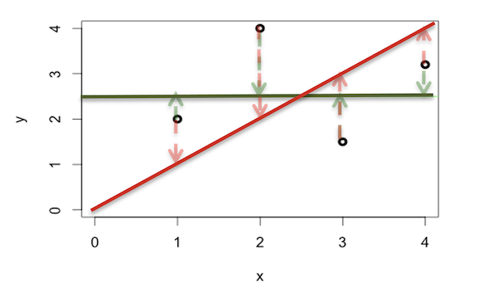

The sum of squares for the red sloped line is

$$ (2 - 1)^2 + (4 - 2)^2 + (1.5 - 3)^2 + (3.2 - 4)^2 = 7.9, $$

and the sum of squares for the green flat line is

$$ (2 - 2.5)^2 + (4 - 2.5)^2 + (1.5 - 2.5)^2 + (3 - 2.5)^2 = 3.75. $$

As the sum of squares for the green line is smaller, we can say it is a better fit to the data.

The coefficient _b_ is related to the correlation coefficient _r_.

$$  r = b \frac{\text{SD}_X}{\text{SD}_Y} $$

If _X_ and _Y_ are positively correlated, then the slope $b$ is positive.

## Regression Hypothesis Test

We can estimate the most suitable values for our model, but how can we be confident that we have indeed found a significant linear relationship?
We can perform a hypothesis test that asks: Is the slope significantly different from 0?

**Hypothesis**

* H<sub>0</sub: b = 0 (no linear relationship)
* H<sub>1</sub>: b ≠ 0 (linear relationship)

**Test of Significance**: $$T = \hat b\ / \text{SE}(\hat b)$$

**Result**: p-value significant or not

**Conclusion**: If p-value is significant, then the slope is different from 0 and there is a significant linear relationship.

## Standard Error

The standard error of Y given X is the average variability around the regression line at any given value of X.
It is assumed to be equal at all values of X.
Each observed residual can be thought of as an estimate of the actual unknown "true error" term.


## Assumptions of Linear Regression

There are four assumptions associated with using linear models:

* the relationship between the independent and dependent variables is linear;
* the observations are independent;
* the variance of the residuals is constant across the observations (homoscedasticity);
* the residuals are normally distributed with mean 0.

These assumptions can be considered criteria that should be met before drawing inferences from the fitted model or using it to make predictions.

The residual e<sub>i</sub> of the _i_th observation is the difference between the observed dependent variable value _Y<sub>i</sub> and the predicted value for the value of the independent variable(s) X<sub>i</sub>,

$$ e_i = Y_i - \hat Y_i = Y_i - (a + bX_i). $$

## Coefficient of Determination

The coefficient of determination _R<sup>2</sup>_ represents the proportion of the total sample variability (sum of squares) explained by the regression model.
This can also be interpreted as the proportion of the variance of the dependent variable that is explained by the independent variable(s).
The most general definition of the coefficient of determination is

$$ R^2 = 1 - \frac{SS_{res}}{SS_{tot}} $$

where _SS<sub>res</sub> is the sum of the squares of the residuals as defined above and _SS<sub>tot</sub>_ is the total sum of squares,

$$ SS_{tot} = \sum_i (Y_i - \bar Y)^2, $$

which is proportional to the variance of the dependent variable.

## Example - Cigarettes and Coronary Heart Disease

*Example from Landwehr & Watkins (1987) and cited in Howell (2004)*

Let us consider the following research question: How fast does CHD mortality rise depending on smoking?

This can be framed as a linear regression problem, where each observation is a particular country and the independent variable is the average number of cigarettes smoked per adult per day and the dependent variable is the CHD mortality rate (deaths per 10,000 per year due to CHD).
The data we will use in this example is given in the table and visualised in the scatter plot, with a line of best fit, below:

Cig. | CHD
---- | ---
11   | 26
9    | 21
9    | 24
9    | 21
8    | 19
8    | 13
8    | 19
6    | 11
6    | 23
5    | 15
5    | 13
5    | 4
5    | 18
5    | 12
5    | 3
4    | 11
4    | 15
4    | 6
3    | 13
3    | 4
3    | 14

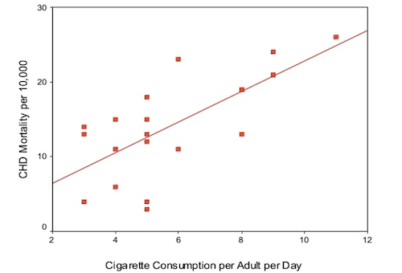

As a reminder, the linear regression equation is

$$ \hat Y = a + bX  $$

In this example, _Y_ is the CHD mortality rate (CHD) and _X_ is the average number of cigarettes smoked per adult per day (CigCons), so the equation is

$$ \text{CHD}_{\text{pred}} = a + b \times \text{CigsCons} + e $$

The intercept _a_ represents the predicted CHD mortality rate in a nation where the average number of cigarettes smoked per adult per day is zero.
The slope _b_ represents the rate of increase of CHD mortality rate for each unit increase in the average number of cigarettes smoked per adult per day.

### Regression Results

The results of fitting a linear model to the data is shown below.

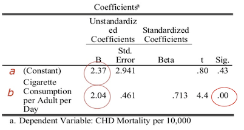

The p-value associated with the prediction of the slope is less than 0.05, indicating there is significant evidence that the slope is different from zero, and therefore there is a significant relationship between cigarette consumption and CHD mortality.

Substituting these values into our linear regression equation, we get the predicted model

$$ \text{CHD}_{\text{pred}} = 2.37 + 2.04 \times \text{CigsCons} $$

We can interpret this as:

* CHD mortality is equal to 2.37 on average when 0 cigarettes are consumed;
* CHD mortality increases by an average of 2.04 units per unit increase in cigarette consumption.

### Making a Prediction

We may want to predict CHD mortality when cigarette consumption is 6, which can be done using our model.

$$ \text{CHD}_{\text{pred}} = 2.37 + 2.04 \times 6 = 14.61 $$

and so we predict that on average 14.61/10,000 people will die of CHD _per annum_ in a country with an average cigarette consumption of 6 per person per day.

### Residuals

Now that we have a fitted model, we can check the residuals between our model and the data we used to fit the model.
In simple regression, the residuals is the vertical distance between the actual and predicted values for each observation; an example of the residual for a particular observation is shown in the figure below.

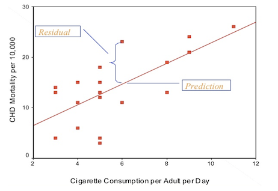

For one observation, there was a CHD mortality of 23 deaths per 10,000 with the average number of cigarettes smoked per adult per day is 6.
Our prediction for the same cigarette consumption level was 14.61 deaths per 10,000, and so the residual for this observation is 23 - 14.61 = 8.39.

For this model, we obtained an _R_ value of 0.71.
Squaring this, we get _R<sup>2</sup>_ = 0.51$, and so we find that almost 50% of the variability of incidence of CHD mortality is associated with variability in smoking rates.

## Linear Regression R Functions

* `result <- lm(Y~X,data=data)`: Get estimated parameters of regression 
* `summary(result)`: Display results of linear regression
* `confint(result)`: Get confidence intervals around estimated coefficients
* `fitted(result)`: Get predicted values for Y
* `resid(result`: Get the residuals of the model

## Exercise - SBP and Age

In this exercise we will be exploring the relationship between systolic blood pressure (the dependent variable) and age (the independent variable) using linear models.

First, we will use a scatter plot to visually check that there is a linear relationship.


```r
plot(data$trestbps~data$age)
```
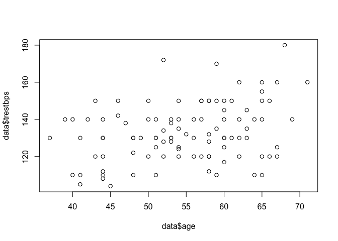

The `lm` function is used to fit a linear model and obtain the estimated values of $a$ and $b$, and we can use the `summary` function to view a summary of the results.


```r
model1 <- lm(trestbps~age,data=data)

summary(model1)
```

~~~
## 
## Call:
## lm(formula = trestbps ~ age, data = data)
## 
## Residuals:
##     Min      1Q  Median      3Q     Max 
## -29.362 -11.385  -0.823  10.185  40.489 
## 
## Coefficients:
##             Estimate Std. Error t value Pr(>|t|)    
## (Intercept) 100.1066    10.1527   9.860 2.44e-16 ***
## age           0.6039     0.1835   3.291  0.00139 ** 
## ---
## Signif. codes:  0 '***' 0.001 '**' 0.01 '*' 0.05 '.' 0.1 ' ' 1
## 
## Residual standard error: 14.83 on 98 degrees of freedom
## Multiple R-squared:  0.09951,	Adjusted R-squared:  0.09033 
## F-statistic: 10.83 on 1 and 98 DF,  p-value: 0.001389
~~~
{: .output}


Under the Coefficients heading, we can view information about the predicted variables and their significance.
We see that age has a significant effect on SBP ($p = 0.00139$) and for each year increase in age there is a 0.60 unit increase in SBP level.

The `confint` function gives us a 95% confidence interval for each model parameter estimate.


```r
confint(model1)
```

~~~
##                  2.5 %      97.5 %
## (Intercept) 79.9588567 120.2542931
## age          0.2397537   0.9681186
~~~
{: .output}


We can interpret the 95% confidence interval for the relationship with age as: We can be 95% confident that the range 0.24 to 0.97 contains the true value of the linear relationship between age and SBP.

The `coefficients` function gives us the model coefficients, as outputted by `summary`.


```r
coefficients(model1)
```

~~~
## (Intercept)         age 
## 100.1065749   0.6039361
~~~
{: .output}


`fitted` gives us the predicted SBP values for each value of age in our data set.


```r
fitted(model1)
```

~~~
##        1        2        3        4        5        6        7        8 
## 138.1546 140.5703 140.5703 122.4522 124.8680 133.9270 137.5506 134.5309 
##        9       10       11       12       13       14       15       16 
## 138.1546 132.1152 134.5309 133.9270 133.9270 126.6798 131.5113 134.5309 
##       17       18       19       20       21       22       23       24 
## 129.0955 132.7191 129.0955 129.6994 138.7585 135.1349 135.1349 135.1349 
##       25       26       27       28       29       30       31       32 
## 136.3427 130.3034 135.1349 139.9664 126.0758 124.2640 141.7782 136.3427 
##       33       34       35       36       37       38       39       40 
## 138.7585 135.7388 126.6798 125.4719 126.0758 134.5309 133.3231 136.9467 
##       41       42       43       44       45       46       47       48 
## 139.3624 124.2640 142.9860 135.7388 136.9467 135.1349 130.9073 130.3034 
##       49       50       51       52       53       54       55       56 
## 139.3624 132.1152 124.8680 139.3624 126.6798 126.6798 136.3427 132.7191 
##       57       58       59       60       61       62       63       64 
## 130.3034 124.8680 132.7191 130.9073 130.9073 127.8876 135.1349 132.7191 
##       65       66       67       68       69       70       71       72 
## 132.7191 136.3427 136.3427 132.7191 135.7388 127.8876 139.3624 140.5703 
##       73       74       75       76       77       78       79       80 
## 137.5506 139.3624 126.6798 139.3624 136.3427 130.9073 129.0955 135.1349 
##       81       82       83       84       85       86       87       88 
## 127.2837 132.1152 123.6601 141.1742 131.5113 126.6798 128.4916 132.1152 
##       89       90       91       92       93       94       95       96 
## 132.1152 130.9073 139.9664 137.5506 137.5506 126.6798 138.1546 131.5113 
##       97       98       99      100 
## 135.7388 136.3427 131.5113 129.0955
~~~
{: .output}


`resid` gives the residuals for each observation in our data set.


```r
resid(model1)
```

~~~
##           1           2           3           4           5           6 
##   6.8454481  19.4297035 -20.5702965   7.5477878   5.1320432 -13.9269989 
##           7           8           9          10          11          12 
##   2.4493842 -14.5309350  -8.1545519   7.8848095   5.4690650   6.0730011 
##          13          14          15          16          17          18 
##  -3.9269989  -6.6797652  40.4887457  15.4690650 -19.0955098   7.2808734 
##          19          20          21          22          23          24 
##   0.9044902   0.3005541 -28.7584880  14.8651288 -15.1348712  -3.1348712 
##          25          26          27          28          29          30 
##  -6.3427435 -10.3033820 -15.1348712  10.0336397  23.9241710 -14.2640206 
##          31          32          33          34          35          36 
##  -1.7781688 -19.3427435   1.2415120  -0.7388073   3.3202348  14.5281071 
##          37          38          39          40          41          42 
##  -6.0758290  15.4690650  -1.3230628  13.0533204  10.6375758  15.7359794 
##          43          44          45          46          47          48 
##  17.0139590  14.2611927  -6.9466796 -23.1348712 -20.9073182  19.6966180 
##          49          50          51          52          53          54 
##   0.6375758  -2.1151905 -19.8679568 -19.3624242 -14.6797652   3.3202348 
##          55          56          57          58          59          60 
##  -6.3427435  -8.7191266   9.6966180 -14.8679568  -7.7191266  -5.9073182 
##          61          62          63          64          65          66 
##  -0.9073182  14.1123625  -7.1348712   2.2808734 -12.7191266   8.6572565 
##          67          68          69          70          71          72 
##   3.6572565  17.2808734  34.2611927  22.1123625  15.6375758 -15.5702965 
##          73          74          75          76          77          78 
## -17.5506158 -29.3624242 -16.6797652  20.6375758 -11.3427435   9.0926818 
##          79          80          81          82          83          84 
##   0.9044902  14.8651288 -23.2837013  -2.1151905  16.3399155  38.8257674 
##          85          86          87          88          89          90 
## -11.5112543  13.3202348   9.5084264  -4.1151905   5.8848095  -0.9073182 
##          91          92          93          94          95          96 
## -19.9663603  22.4493842  -7.5506158 -18.6797652  -3.1545519  -3.5112543 
##          97          98          99         100 
## -25.7388073  13.6572565   2.4887457  -7.0955098
~~~
{: .output}


By using `abline` with our model after plotting a scatter plot, we can plot the estimated regression line over our data.


```r
plot(trestbps~age,data=data)
abline(model1,col="red")
```
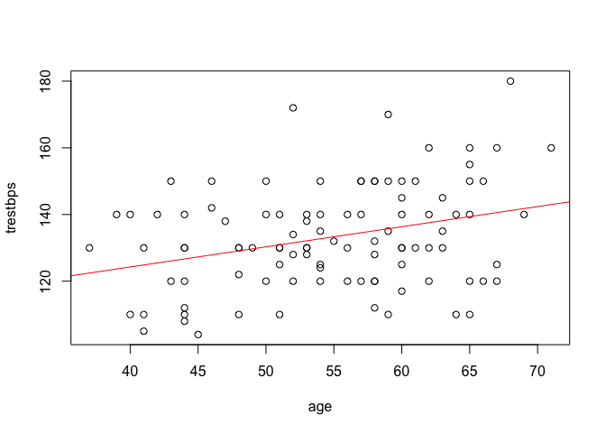

We can do the same with ggplot2.


```r
library(ggplot2)
ggplot(data, aes(x=age, y=trestbps)) +
  geom_point(shape=16,size=2) +
  geom_smooth(method=lm,se=F)+
  theme(axis.text=element_text(size=12),
        axis.title=element_text(size=14,face="bold"))
```
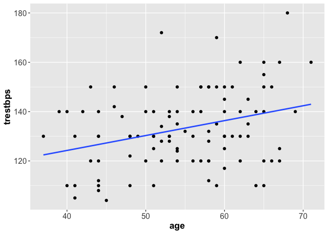

### Confidence and Prediction

We can use the `predict` function to predict SBP for each value of age in our data set and also get confidence or prediction intervals for each observation.
The type of interval is specified using the `int` argument to the function, with `int="c"` for confidence intervals and `int="p"` for prediction intervals.

Confidence intervals tell us how well we have determined the estimate parameters.
The standard error for a CI takes into account the uncertainty due to sampling.

Prediction intervals tell us in what range a future individual observation will fall.
The standard error for a PI takes into account the uncertainty due to sampling as well as the variability of the individuals around the predicted mean.

Both intervals will be centered around the same value but the standard errors will be different.
A prediction interval is always wider than a confidence interval. 

For example, here we obtain the confidence intervals for each prediction.


```r
predict(model1, int="c")
```

~~~
##          fit      lwr      upr
## 1   138.1546 133.9440 142.3651
## 2   140.5703 135.2200 145.9206
## 3   140.5703 135.2200 145.9206
## 4   122.4522 115.3564 129.5480
## 5   124.8680 119.0662 130.6697
## 6   133.9270 130.9485 136.9055
## 7   137.5506 133.5924 141.5088
## 8   134.5309 131.4746 137.5872
## 9   138.1546 133.9440 142.3651
## 10  132.1152 129.1061 135.1243
...
~~~
{: .output}


Note that when we have a model fitted using `lm`, the `predict` and `fitted` functions give the same predicted values.

## What can go wrong?

As discussed, there are some assumptions that need to be met to use a linear model and we must check if they are being violated before using our model to draw inferences or make predictions.
Such violations are:

* In the linear regression model:
  - Non-linearity (e.g. a quadratic relation or higher order terms).
* In the residual assumptions:
  - Non-normal distribution;
  - Non-constant variances;
  - Dependency;
  - Outliers.
  
The checks we need to make are:

* Linearity between outcome and predictors
  - Plot residuals vs. predictor variable (if non-linearity try higher-order terms in that variable)
* Constant variance of residuals
  - Plot residuals vs. fitted values (if variance increases with the response, apply a transformation to the data)
* Normality of residuals
  - Plot residuals Q-Q norm plot (significant deviation from a straight line indicates non-normality)
  
### Making the Checks

We can make the above checks manually by creating the necessary plots.

**Linearity between outcome and predictor**: Residuals vs predictor variable


```r
plot(resid(model1)~age,data=data)
```


**Constant variance of residuals**: Residuals vs fitted values


```r
plot(resid(model1)~fitted(model1))
```


**Normality of residuals**: Q-Q plot of residuals


```r
qqnorm(resid(model1))
```
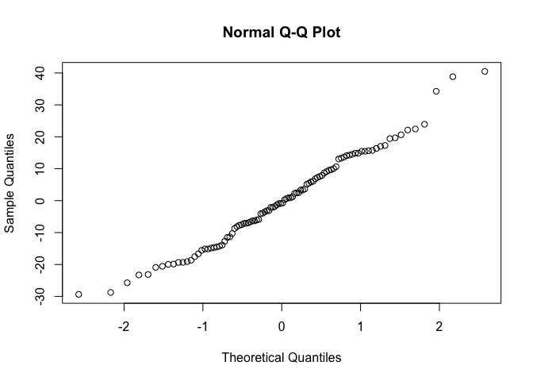

Or, we can use R's built-in diagnostic plotting with the `plot` function.

```r
par(mfrow=c(2,2))
plot(model1)
```
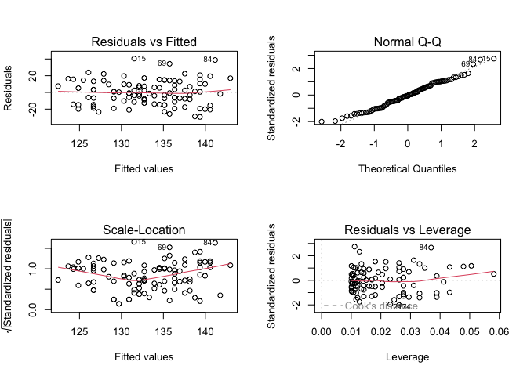

Let's break down each of these plots.

For the *Residuals vs Fitted* plot, the residuals should be randomly distributed around the horizontal line representing a residual error of zero; that is, there should not be a distinct trend in the distribution of points.
Good and bad examples of these plots are shown in the figures below.

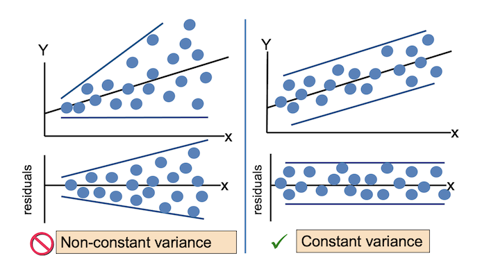

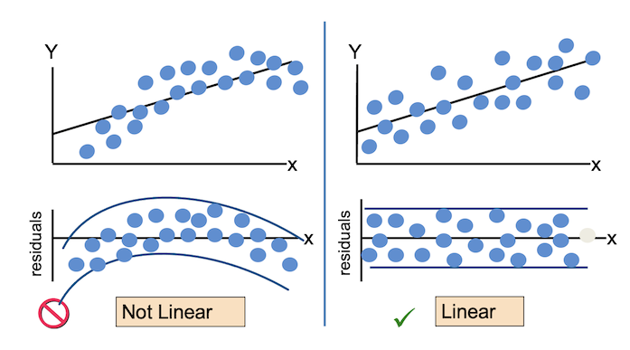

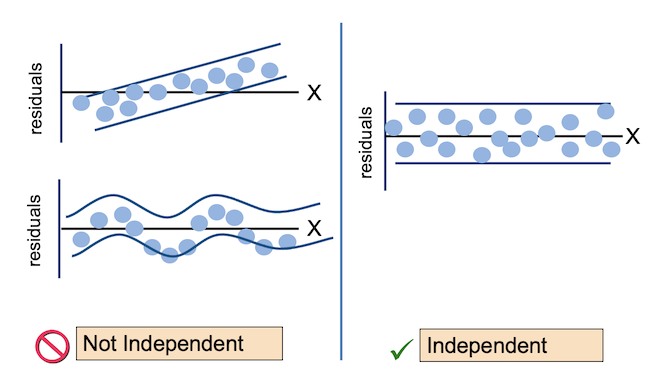

*Normal Q-Q* plots the ordered standardised residuals against their theoretical expectations.
We expect these points to lie on a straight line, with significant deviation from a straight line indicating non-normality.

*Scale-Location* plots the square root of the standardised residuals (think of the square root of a measure of relative error) as a function of the fitted values.
Again, there should be no obvious trend in this plot.

*Point Leverage* (Residuals vs Leverage) gives us a measure of importance of each point in determining the regression result. 
If any point in this plot falls outside of a Cook’s distance of 1 (indicated by the red dashed lines) then it is conventionally considered to be an influential observation.

## Leverage Points 

* Leverage points are observations which have an _x_-value that is distant from other _x_-values.
* These points have great influence on the fitted model, in that if they were to be removed from the data set and the model refitted, the resulting model would be significantly different from the original.
* Leverage points are bad if it is also an outlier (the _y_-value does not follow the pattern set by the other data points).
* Never remove data points unless we are certain that the data point is invalid and could not occur in real life.
* Otherwise, we should fit a different regression model if we are not confident that the basic linear model is suitable.
* We can create a different regression model by including higher-order terms or transforming the data.

## Cook's Distance

The Cook's distance statistic _D_ combines the effects of leverage and the magnitude of the residual and is used to evaluate the impact of a given observation on the estimated regression coefficient.
As a rule of thumb, a point with Cook's distance greater than 1 has undue influence on the model.

## Statistical Tests for Model Assumptions

There are a number of statistical tests available from the `lmtest` package that can be used to test for violations of the assumptions of a linear model.

For the Breusch-Pagan test of homoscedesiticity, the null hypothesis is the variance is unchanging in the residual.


```r
library(lmtest)
bptest(model1, ~ age, data = data, studentize = FALSE)
```

~~~
## 
## 	Breusch-Pagan test
## 
## data:  model1
## BP = 1.8038, df = 1, p-value = 0.1793
~~~
{: .output}


For the Breusch-Godfrey test for higher-order serial correlation, the null hypothesis is the residuals are independent.


```r
library(lmtest)
bgtest(model1, order = 1, order.by = NULL, type = c("Chisq", "F"), data = list())
```

~~~
## 
## 	Breusch-Godfrey test for serial correlation of order up to 1
## 
## data:  model1
## LM test = 0.41755, df = 1, p-value = 0.5182
~~~
{: .output}


For the Goldfeld-Quandt test against heteroscedasticity, the null hypothesis is the errors are homoscedastic (equal variance).


```r
library(lmtest)
gqtest(model1, point = 0.5, fraction = 0, alternative = c("greater", "two.sided", "less"),
       order.by = NULL, data = list())
```

~~~
## 
## 	Goldfeld-Quandt test
## 
## data:  model1
## GQ = 1.2121, df1 = 48, df2 = 48, p-value = 0.2538
## alternative hypothesis: variance increases from segment 1 to 2
~~~
{: .output}


Each of these tests show that the models assumptions are met.

There are other packages you can use to test the assumptions of the model, such as the `car` library.
``qqPlot` gives us a QQ plot with 95% confidence intervals.


```r
library(car)
qqPlot(model1, main="QQ Plot")
```


`outlierTest` tests for outliers and prints a p-value for the most extreme outlier.

```r
outlierTest(model1)
```

~~~
## No Studentized residuals with Bonferroni p < 0.05
## Largest |rstudent|:
##    rstudent unadjusted p-value Bonferroni p
## 15  2.84362          0.0054398      0.54398
~~~
{: .output}


In this case, we observe no significant outliers.

## Exercise - SBP and Sex

In this exercise we will be exploring the relationship between systolic blood pressure (the dependent variable) and sex (the independent variable) using linear models.
The main difference between this exercise and the last is that age is a numerical variable and sex is binary.

Comparing boxplots can give us a good indication if the distributions of SBP is different between males and females.


```r
ggplot(data = data, aes(x = sex,y = trestbps, fill="blues")) + 
  geom_boxplot()
```


Visually, it seems that females on average have a higher systolic blood pressure than males.
The male distribution seems to be right-skewed.
We can test for normality for both variables using `shapiro.test`.


```r
by(data$trestbps,data$sex, shapiro.test)
```

~~~
## data$sex: Female
## 
## 	Shapiro-Wilk normality test
## 
## data:  dd[x, ]
## W = 0.95866, p-value = 0.3046
## 
## ------------------------------------------------------------ 
## data$sex: Male
## 
## 	Shapiro-Wilk normality test
## 
## data:  dd[x, ]
## W = 0.94999, p-value = 0.006713
~~~
{: .output}


We see here that there is significant evidence that the male dataset is non-normally distributed, and so we cannot use a t-test to determine if the means are different.
The Wilcoxon rank sum test, given by `wilcox.test` in R, is a non-parametric alternative to the unpaired two-samples t-test.


```r
wilcox.test(data$trestbps~data$sex)
```

~~~
## 
## 	Wilcoxon rank sum test with continuity correction
## 
## data:  data$trestbps by data$sex
## W = 1260, p-value = 0.07859
## alternative hypothesis: true location shift is not equal to 0
~~~
{: .output}


The p-value of approximately 0.08 indicates that male's and female's systolic blood pressure are not significantly different.

Now, let’s run a regression model to test the relationship between SBP and sex when SBP is considered as the outcome variable.


```r
model_sex <- lm(trestbps~sex,data=data)
summary(model_sex)
```

~~~
## 
## Call:
## lm(formula = trestbps ~ sex, data = data)
## 
## Residuals:
##    Min     1Q Median     3Q    Max 
## -31.76 -11.69  -1.69   8.31  48.31 
## 
## Coefficients:
##             Estimate Std. Error t value Pr(>|t|)    
## (Intercept)  136.759      2.869  47.664   <2e-16 ***
## sexMale       -5.068      3.405  -1.488     0.14    
## ---
## Signif. codes:  0 '***' 0.001 '**' 0.01 '*' 0.05 '.' 0.1 ' ' 1
## 
## Residual standard error: 15.45 on 98 degrees of freedom
## Multiple R-squared:  0.02211,	Adjusted R-squared:  0.01213 
## F-statistic: 2.216 on 1 and 98 DF,  p-value: 0.1398
~~~
{: .output}


In this model, the first level of sex has been taken as reference (Females).
We can think of females being assigned a value of 0 in the linear model and males a value of 1.
Therefore, the model estimates that females, on average, have a systolic blood pressure of __136.76__, and for males __136.76 - 5.07 = 131.69__.
However, we see that the p-value for the sex effect is not significant, and so we can conclude that there is no difference in SBP between men and women.

Again, we can view and report the confidence intervals for the model coefficients for the model using `confint`.


```r
confint(model_sex)
```

~~~
##                 2.5 %     97.5 %
## (Intercept) 131.06475 142.452488
## sexMale     -11.82586   1.688897
~~~
{: .output}


And we can check the assumptions of the model by plotting the model diagnostics.


```r
par(mfrow=c(2,2))
plot(model_sex)
```


Intepreting these model diagnostics is a bit harder, as we are using a binary predictor and thus only fitted values for the entire dataset.

* The variance of the residuals appears to be similar between the sexes.
* Our normal Q-Q plot shows little deviation from a straight line.
* In our Residuals vs. Leverage plot, no points fall outside of Cook's distance.
